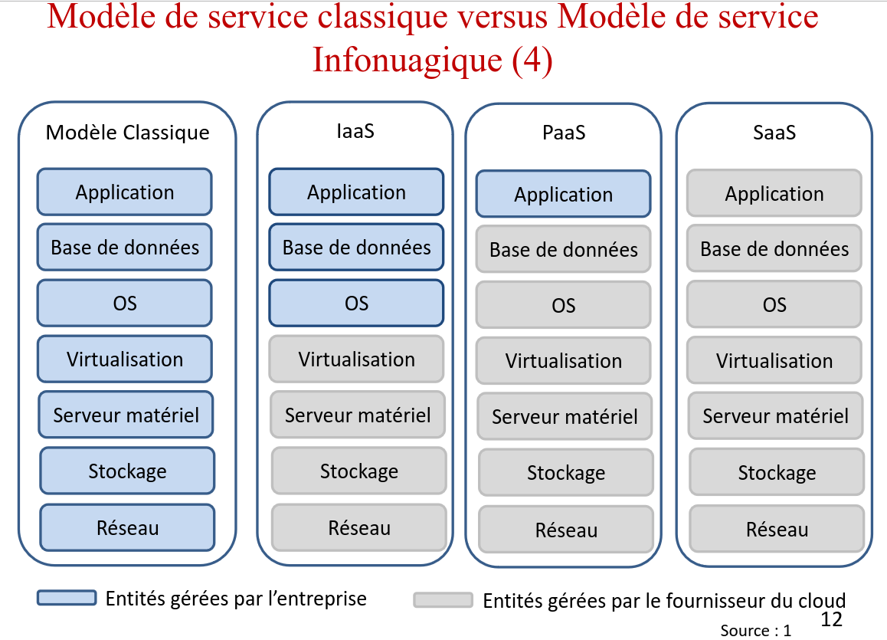

## Chapitre 5
[Spanning Tree Protocol](https://inv.vern.cc/watch?v=j-bK-EFt9cY)

* Spanning tree enables redundant level 2 networks. (Delivery of data between two directly connected devices on a network.)
* Having multiple paths between switches allows multiple paths if one switch fails.
* Classic Spanning Tree Protocol is IEEE 802.1D and ALL vendors run STP by default.
* STP prevents Layer 2 loops by placing redundant ports in a block state, essentially disabling
the interface.
* These interfaces act as backups that can enter a forwarding state if an active interface fails.
* Interfaces in a forwarding state behave normally. They send and receive all normal traffic.
* Interfaces in a blocking state can only send or receive STP messages.
* What's nice is that the switches will automatically adjust the topology if an interface fails.
* By selecting which ports are forwarding and which ports are blocking, STP creates a single path to/from each point in the network. This prevents Layer 2 loops.
* STP-enabled switches send/receive Hello BPDUs out of all interfaces every 2 seconds. If a switch receives the Hello, it knows that the interface is connected to another switch.
* Switches use one field in the STP BPDU, the *Bridge ID* field, to elect a *root bridge* for the network.
* The lowest priority always wins, if bridges have the same priority then the lowest MAC wins.
* The root cost is the total cost of the interfaces on the path to the root bridge.
* You don't count the cost of the receiving interface, just the sending (outgoing) ones.

### STP Steps

1. One switch is elected as the root bridge. All ports on the root bridge are *designated ports*.

	Root bridge selection: 

		Lowest bridge ID (lowest priority wins or if equal priorities lowest MAC)

2. Each remaining switch will select ONE of its interfaces to be its *root port*. Ports across from the root port
of another bridge are always *designated* ports.
(Designated port: Port that has been determined to be the best path for forwarding traffic towards the root bridge.)

	Root port selection:

		1. Lowest root cost
		2. Lowest neighbor bridge ID 
		(A bridge with a lower priority will always have a lower bridge ID, regardless of the MAC of the bridge its being compared to)
		3. Lowest neighbor port ID

## Ce que j'ai appris

* Qu'est-ce qu'un VLAN?
	* Garantissent une segmentation virtuelle des reseaux.
	* Domaines de diffusion fermes qui ne communiquent entre eusdaq qu'a travers des routeurs.
	* Pourquoi on voudrait des vlans? Lorsqune hote envoie un broadcast, on ne veut pas envoyer a tout le reseau.
	* Un routeur pourrait faire la meme chose (diviser les reseaux) mais c'est un equipement physique qu'il faut acheter... pas optimal ni scalable.
	* Les vlans offrent tous les benefices de la division physique de reseau mais de facon virtuelle!
	* A switch can have many vlans.
	* A trunk is a port that can send traffic between vlans on different switches.
* Qu'est-ce que VTP? [VTP](https://inv.vern.cc/watch?v=Nlyx5lFQR34)
	* VTP propage les changements faits sur une switch aux autres switchs qui participent au reseau VTP.
	* Modes
		* Serveur: Ajouter, modifier et supprimer des VLANs, diffuse ces informations a tous les commutateurs du reseau qui appartiennent au domaine VTP.
		* Client: Recoit et propage les informations de configuration aux commutateurs voisins. Ne peut pas etre utiliser pour ajouter, modifier, supprimer des vlans.
		* Client: Recoit et propage les informations de configuration aux commutateurs voisins. Ne peut pas etre utilise pour ajouter, modifier, supprimer des vlans.
		* Transparent: Permet de configurer des VLANs en local et aussi de transmettre les infos de VLAN configures ailleurs aux routeurs voisins.	
* Qu'est-ce que VTP pruning?
	* Utile pour reduire le traffic superflu sur des vlan trunks.
* Avantage de MST
	* Permet une meilleure gestion de la bande passante et ameliore le temps de convergence.
	* Pour n vlans, il faut n instances STP. Pour reduire le nombre d'instances STP dans un environnement comprenant
	  plusieurs vlans, mst est utilise.
	* MST cree une instance STP pour un group de vlans.

## Chapitre 6
* Quels sont les modeles de service du cloud?
	* Software as a Service (SaaS): Services accessibles a travers une application offerte a l'usager par le nuage.
		* Example: Amazon Connect
	* Platform as a Service (PaaS): Ensemble d'environnements et d'outils de developpement offerts par le fournisseur du nuage au client pour developper et deployer des applications sur l'infrastructure infonuagique.
		* Example: AWS Elastic Beanstalk, AWS Lambda, AWS App Runner
	* Infrastructure as a Service (IaaS): Services informatiques (CPU, stockage, reseaux) accessible a l'usager qui est en mesure de deployer et executer des logiciels. L'usager peut controler l'OS, les applications et les composantes (Firewall, IDS, etc.)
		* Example: EC2, S3, VPC (Virtual Private Cloud), RDS (Relational Database Service)

	
* Qu'entend-t-on par la virtualisation du reseau?
	* Abstraction des ressources physiques du reseau tels que les commutateurs, routeurs, serveurs et une version
	  logicielle et flexible.
* Elasticite
	* Vertical: Augmenter/reduire la capacite en ressources de la machine virtuelle/container
	* Horizontal: Ajouter plus de machines virtuelles/containers
* Deux techniques utilisees dans la migration
	* Migration basee sur la pre-copie de la memoire (La MV est en execution, ses pages memoires sont marques read-only avant d'etre copiees, une fois toutes les pages copiees la MV source est suspendue et la MV dest. prend la releve)
	* Migration basee sur la post-copie de la memoire (La MV source est suspendue, les registres et la memoire de la MV source sont copies dans la MV de dest., la MV de dest. prend la releve et le contenu de la mem. de MV source est copie progressivement)
* Qu'est-ce que NFV?
	* Migrer des composantes physiques d'un reseau telles qu'un routeur, commutateur, pare-fun, load-balencer vers des machines virtuelles ou des containers qui tournent sur du hardware generique.

## Chapitre 7

## Chapitre 8

## Chapitre 9

## Chapitre 10

