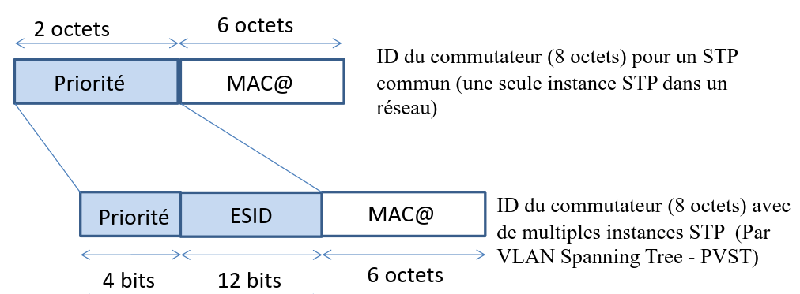
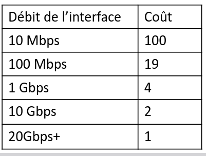
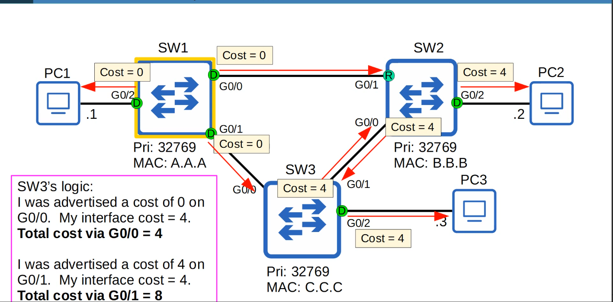

## Chapitre 5 ##
[Spanning Tree Protocol](https://inv.vern.cc/watch?v=j-bK-EFt9cY)

* Spanning tree enables redundant level 2 networks. (Delivery of data between two directly connected devices on a network.)
* Having multiple paths between switches allows multiple paths if one switch fails.
* Classic Spanning Tree Protocol is IEEE 802.1D and ALL vendors run STP by default.
* STP prevents Layer 2 loops by placing redundant ports in a block state, essentially disabling
the interface.
* These interfaces act as backups that can enter a forwarding state if an active interface fails.
* Interfaces in a forwarding state behave normally. They send and receive all normal traffic.
* Interfaces in a blocking state can only send or receive STP messages.
* What's nice is that the switches will automatically adjust the topology if an interface fails.
* By selecting which ports are forwarding and which ports are blocking, STP creates a single path to/from each point in the network. This prevents Layer 2 loops.
* STP-enabled switches send/receive Hello BPDUs out of all interfaces every 2 seconds. If a switch receives the Hello, it knows that the interface is connected to another switch.
* Switches use one field in the STP BPDU, the *Bridge ID* field, to elect a *root bridge* for the network.
* The lowest priority always wins, if bridges have the same priority then the lowest MAC wins.
* The root cost is the total cost of the interfaces on the path to the root bridge.
* You don't count the cost of the receiving interface, just the sending (outgoing) ones.

### STP Steps ###

1. 
2. 
3. 

## Chapitre 6 ##
Lorem ipsum dolor sit amet.

## Chapitre 7 ##
## Chapitre 8 ##
## Chapitre 9 ##
## Chapitre 10 ##

